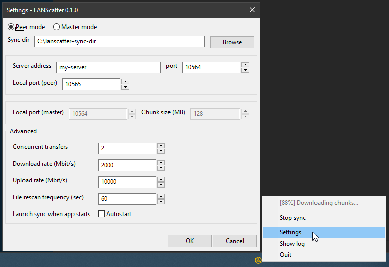

# Efficient large file distributor for Local Area Networks

[](https://travis-ci.com/elonen/lanscatter)
[]()
[]()


## Introduction

LANScatter is a P2P assisted, server-driven one-way folder synchronizer, designed for large files in reliable, private LANs.

## Installing

```
python3.7 -m venv venv
source venv/bin/activate    # Windows: CALL venv\Scripts\activate
pip install --editable git+ssh://git@github.com/elonen/lanscatter.git#egg=lanscatter
```

...or download a [binary release](https://github.com/elonen/lanscatter/releases) (especially Gui for Windows)

## Operation

User who has files to distribute runs **master node** (CLI or GUI program), and leechers run **peer nodes** that connect to it (with user-provided websocket URL):

1. Start master:

   `my.server:~$ lanscatter_master ./from-dir`

2. Start peers:

   ```
   Workstation-A:~$ lanscatter_peer ./to-dir my-server
   Workstation-B:~$ lanscatter_peer ./to-dir my-server
   Workstation-C:~$ lanscatter_peer ./to-dir my-server
   ...
   ```
   If command line is not your thing, a simple systray GUI is also available:
   
   

3. Wait. LANScatter is designed for distributing folders with dozens+ gigabytes of files, so hashing (calculating checksums) and transferring them will take a while.

4. **[Optional]** Point a web browser to `http://server:10564/` to monitor the swarm.


Master splits sync folder contents into _chunks_, calculates checksums, transfers them to different peers, and organizes peers to download chunks from each other optimally.

Changes on master's sync folder are mirrored to all connected peers, and any changes on peer sync folders are overwritten. Peers can leave and join the swarm at any time. Stopped syncs are automatically resumed.

According to simulations (see _Testing_ below) this should yield 50% – 90% distribution speed compared to ideal (unrealistic) simultaneous multicast – depending on other load on the nodes and network.

## Features

Notable features and differences to Bittorrent-based solutions like
Btsync/Resilio, and Dropbox-like software:

* It's a _one way synchronizer_ for distributing large folders 1-to-N, not a generic two-way syncer.
* Keeps only a _single copy of each file_ to save space – no `.sync` dirs with duplicate files
* Centralized coordination, distributed transfers.  Few TCP connections, no broadcasts. (Peers connect to a master via websocket, and it instructs them to make HTTP downloads from each other or the master).
* Designed for _big chunk sizes_ to minimize coordination overhead. (Configurable, e.g. for deduplication if data is highly redudant.)
* Designed for _few simultaneous transfers_. This avoids unnecessary coordination traffic and overhead, assuming a reliable and fast LAN environment.
* Keeps traffic inside the LAN (doesn't connect to any third party servers).
* Resilient against slow individual nodes. Transfers from slow peers detected, aborted and avoided after that.
* Supports bandwidth limiting.

## Technologies

Lanscatter is built on _Python 3.7_ using asyncio (aiohttp & aiofiles),
_wxPython_ for cross-platform GUI, _Blake2b_ for hash/checksum algorithm, _pytest_ for unit/integration tests
and _pyinstaller_ for packaging/freezing into exe files.

## Architecture

Notable modules:

* **planner.py**: Protocol-agnostic distribution planner. Takes a list of chunk hashes and nodes, keeps track who has which chunks and outputs download suggestions. When ran as a stand-alone CLI program, it runs a **swarm simulation**, that can be used for testing and tuning the distribution strategy.

* **common.py**: Default constants and some common utils.

* **chunker.py**: Functions to scan a directory, split files into chunks and calculating checksums. Outputs `SyncBatch` class instances, that represent contents of scanned sync directory. Includes functions for comparing and (de)serializing them.

* **fileio.py**: Functions for uploading and downloading chunks from/to files on disk. Supports bandwidth throttling and limits operations inside a base directory (sync dir) for safety.

* **fileserver.py**: HTTP(S) server base that serves out chunks of files from sync dir. Used by both master node and peer nodes.

* **masternode.py**: CLI program that runs a master node.

* **peernode.py**: CLI program that runs a peer node.

* **gui.py**: Systray-based GUI for launching, controlling and monitoring both master nodes and peer nodes.

## Testing

The `tests` folder contains integration and unit tests using the _pytest_ framework.

Integration test – in short – runs a master node and several peer node simultaneously, with random sync dir contents, and makes sure they get in sync without errors.

Planner is (unit)tested in isolation to make sure it terminates in a fully synced-up state. It simulates joins, drop-outs and slow peers,  with an output that looks like this:

```
N00 ######################################################################## 0 4   0.3
N01 ####..#.####.##.....#................................................... 2 2   0.2
N02 #.###...##.#.#.......................................................... 2 2   0.3
N03 #.###...##.#.#.......................................................... 2 2   0.3
N04 #.####...#.##.....#..................................................... 2 0   25.1
N05 #.###.#....#..##..#...#.#..#............................................ 2 2   0.2
N06 ###.#..##......###..............#....................................... 2 2   28.5
N07 #####.#.#....###.#............#......................................... 2 2   0.3
N08 ##..#.#..###.###.........#....#......................................... 2 2   0.3
N09 ..##.....##...#.....#.#....###.#........................................ 2 2   0.3
N10 #.##..#.####........#....#...#.......................................... 2 2   0.3
N11 ##....#..###.###.##..................#.................................. 2 2   0.3
N12 .#.#..#...##.###.#....#........#........................................ 2 2   0.2
N13 ##.##.#.#....####....................................................... 2 2   0.3
N14 ##.#..#..##..##...#...#....#...#........................................ 2 2   0.3
N15 ..#.#...##..#....#.....##.#...#..#...................................... 2 2   0.3
N16 ##.#....#.##.###.#.....#.......#........................................ 2 2   0.3
N17 ...#..#.##...#..#.#.........#...#..##................................... 2 2   0.3
N18 .#..#.#.##.#...##.#.........#...#....................................... 2 0   23.7
N19 .##.#.#.#....#...#.....#................................................ 2 2   0.2
N20 ####..#..####....##..................................................... 2 2   0.3
N21 .#.##...#.#.######...............#...................................... 2 2   0.2
N22 ##..#.#...##...#.##....##............................................... 2 2   0.2
N24 .####....##.#.#####..................................................... 2 2   0.3
N25 .#......##.#.####.#...............#..................................... 2 2   0.3
N27 ..#.#....#..######.....#..#............................................. 2 2   0.3
N28 ...##...#.##.###...#....#............................................... 2 2   29.2
N29 ..##..#.###..##........#.#.............................................. 2 2   0.3
N30 #.###.#...##.##......................................................... 2 2   0.3
N31 #.#.#.#..###.##.......#................................................. 2 2   0.3
N32 ##.#..#.#.#..##.#....................................................... 2 2   28.1
N33 ##..#.#.#.##.###........................................................ 2 2   0.3
N34 ..##..#.###..#.........##............................................... 2 2   0.3
N35 .##.#.#.#..#...####..................................................... 2 2   0.2
N36 .........#...###.#..#....#..##.......................................... 2 2   0.3
N37 ...............#.##....##............................................... 2 2   0.3
Node join: N35
Node join: N36
Node join: N37
Slow download. Giving up. (from N04)
Slow download. Giving up. (from N04)
```

Left column is a list of node names.
Table with hash characters and dots show which chunks each node has.
Numbers on the right show current downloads, current uploads and average time it takes to upload one chunk from each node.

## License

Copyright 2019 Jarno Elonen <elonen@iki.fi>

Licensed under the Apache License, Version 2.0 (the "License");
you may not use this file except in compliance with the License.
You may obtain a copy of the License at

    http://www.apache.org/licenses/LICENSE-2.0

Unless required by applicable law or agreed to in writing, software
distributed under the License is distributed on an "AS IS" BASIS,
WITHOUT WARRANTIES OR CONDITIONS OF ANY KIND, either express or implied.
See the License for the specific language governing permissions and
limitations under the License.
